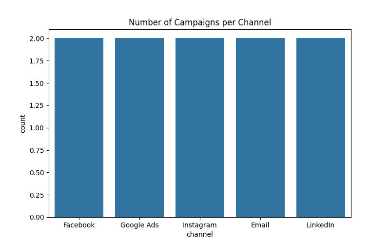
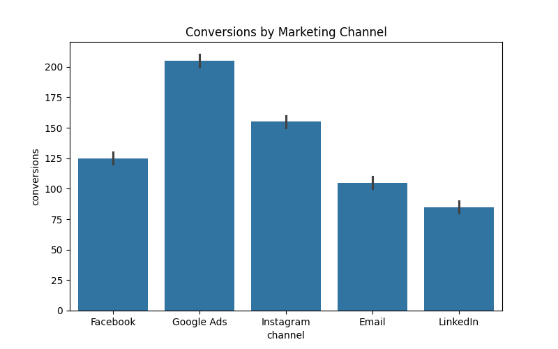
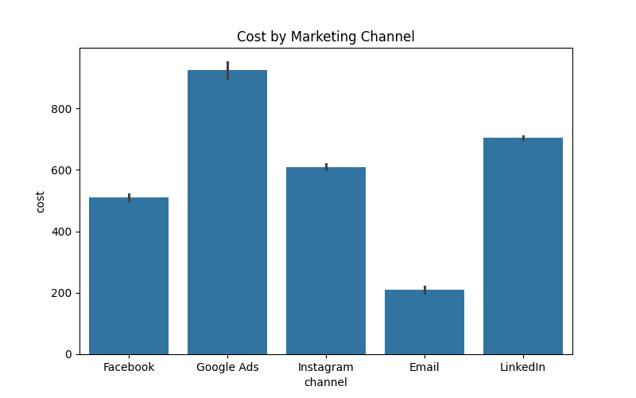
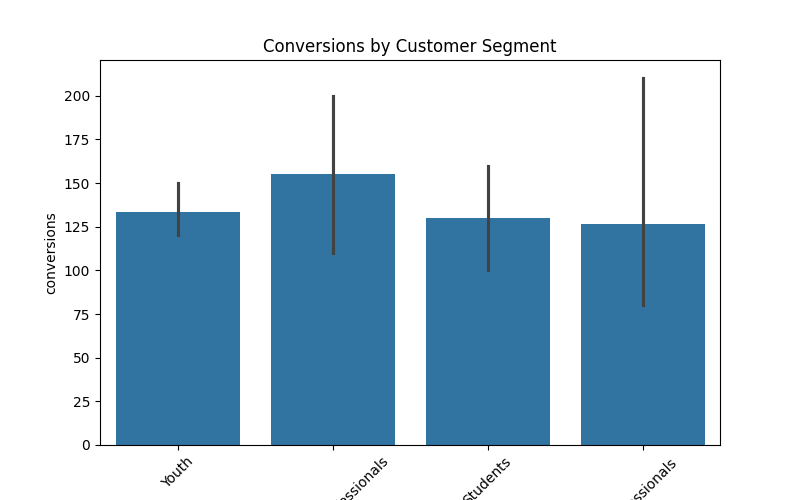
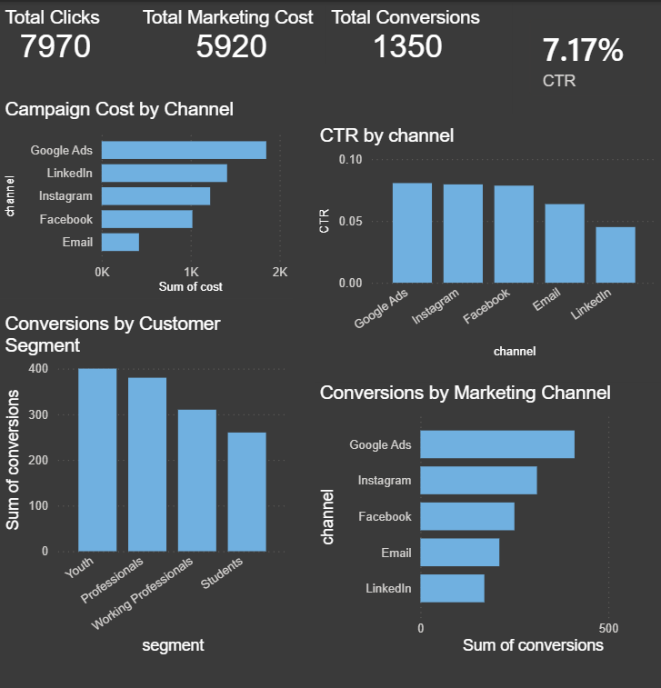

# Marketing Campaign Performance Analytics

A complete **data analytics project** analyzing marketing campaign performance using **Python, SQL, and Power BI** to uncover insights about campaign efficiency, customer engagement, and marketing ROI.

This project demonstrates a **real-world data analytics workflow**, from data exploration and SQL analysis to building a professional dashboard.

---

# Table of Contents

- Project Overview
- Business Problem
- Project Objectives
- Dataset Description
- Technology Stack
- Project Structure
- Exploratory Data Analysis
- SQL Analysis
- Marketing KPIs Calculated
- Power BI Dashboard
- Key Insights
- Business Recommendations
- Skills Demonstrated
- Future Improvements
- How to Run the Project
- Author

---

# Project Overview

Modern companies spend large amounts of money on marketing campaigns across multiple digital platforms such as Facebook, Google Ads, Instagram, and Email marketing.

However, without proper analytics it is difficult to understand:

- Which marketing channel performs best
- Which campaigns generate the highest conversions
- Whether the marketing budget is being used effectively

This project analyzes campaign performance data and builds a **visual analytics dashboard** to support data-driven marketing decisions.

---

# Business Problem

Marketing teams run campaigns across many channels but often struggle to answer key business questions such as:

- Which platform generates the highest conversions?
- Which campaigns are the most cost efficient?
- Which customer segments respond best to marketing campaigns?

Without data analysis, companies risk spending marketing budgets inefficiently.

This project solves that problem by analyzing campaign performance and visualizing insights through a dashboard.

---

# Project Objectives

The primary goals of this project are:

- Analyze marketing campaign performance data
- Identify the most effective marketing channels
- Evaluate campaign cost efficiency
- Calculate important marketing KPIs
- Build a visual analytics dashboard for decision-making

---

# Dataset Description

The dataset represents marketing campaign data collected from multiple digital advertising platforms.

### Key Features in the Dataset

| Column | Description |
|------|------|
campaign_id | Unique identifier for each campaign |
channel | Marketing platform (Facebook, Google Ads, Instagram, Email, LinkedIn) |
impressions | Number of times the advertisement was shown |
clicks | Number of users who clicked the advertisement |
conversions | Number of successful conversions |
cost | Total cost spent on the campaign |
segment | Customer segment targeted |
date | Date of the campaign |

---

# Technology Stack

This project uses a modern data analytics stack.

### Programming & Data Analysis

Python  
Pandas  
Matplotlib  
Seaborn  

### Querying

SQL

### Visualization

Power BI Desktop

### Development Tools

Git  
GitHub  
VS Code

---

# Project Structure

marketing-campaign-analytics
│
├── data
│ └── marketing_campaign.csv
│
├── notebooks
│ └── campaign_analysis.ipynb
│
├── scripts
│ └── analysis.py
│
├── visuals
│ ├── campaign_distribution.png
│ ├── conversions_by_channel.png
│ ├── cost_by_channel.png
│ ├── conversions_by_segment.png
│ └── powerbi_dashboard.png
│
├── marketing_dashboard.pbix
├── requirements.txt
└── README.md

---

# Exploratory Data Analysis (EDA)

Exploratory data analysis was performed using Python to understand campaign patterns and performance.

## Campaign Distribution by Channel

This visualization shows how marketing campaigns are distributed across different platforms.

---

## Conversions by Marketing Channel

This chart identifies which marketing channel generates the most conversions.

---

## Campaign Cost by Channel

This chart compares the marketing cost spent across different platforms.

---

## Customer Segment Performance

This visualization shows which customer segments generate the most conversions.

---

# SQL Analysis

SQL queries were used to analyze campaign performance and extract insights from the dataset.

### Example Query

SELECT channel,
SUM(conversions) AS total_conversions
FROM marketing_campaign
GROUP BY channel
ORDER BY total_conversions DESC;

### Purpose

This query helps identify the marketing channels that generate the highest number of conversions.

---

# Marketing KPIs Calculated

Key marketing metrics were calculated to evaluate campaign effectiveness.

### Click Through Rate (CTR)

CTR = Clicks / Impressions

CTR measures the percentage of users who click an advertisement after seeing it.

---

### Conversion Rate

Conversion Rate = Conversions / Clicks

This metric shows how effectively ad clicks turn into conversions.

---

### Cost per Conversion

Cost per Conversion = Campaign Cost / Conversions

This helps evaluate the efficiency of marketing spending.

---

# Power BI Dashboard

An interactive dashboard was created using **Power BI Desktop** to visualize campaign performance.

The dashboard includes:

- Total Clicks
- Total Campaign Cost
- Click Through Rate (CTR)
- Conversions by Channel
- Cost by Channel
- Conversions by Customer Segment

### Dashboard Preview

---

# Key Insights

The analysis produced several important insights:

1. Google Ads generated the highest number of conversions.
2. Email marketing showed the lowest cost per conversion.
3. Instagram campaigns performed well among younger customer segments.
4. LinkedIn campaigns showed strong engagement with professional audiences.
5. Facebook campaigns delivered stable performance across multiple segments.

---

# Business Recommendations

Based on the analysis, the following recommendations can improve marketing performance:

Increase investment in high-performing channels such as Google Ads.

Expand email marketing campaigns due to their high cost efficiency.

Target younger audiences using Instagram campaigns.

Optimize LinkedIn campaigns by refining audience targeting.

Monitor campaign performance regularly using analytics dashboards.

---

# Skills Demonstrated

This project demonstrates several key data analytics skills:

- Data Cleaning and Data Exploration
- Exploratory Data Analysis (EDA)
- Data Visualization
- SQL Querying
- Marketing KPI Analysis
- Business Insight Generation
- Dashboard Development
- Data Storytelling

These are essential skills for modern **data analyst roles** in industries such as finance, banking, marketing, and technology.

---

# Future Improvements

Possible improvements for this project include:

- Integrating real-time campaign data
- Adding predictive analytics models
- Implementing marketing A/B testing analysis
- Deploying dashboards using Power BI Service
- Building automated reporting pipelines

---

# How to Run the Project

### Clone the Repository

git clone https://github.com/Yaswanth-23/marketing-campaign-analytics.git

### Install Dependencies

pip install -r requirements.txt

### Run Python Analysis

python scripts/analysis.py

### Open the Dashboard

Open the Power BI file:

marketing_dashboard.pbix

using **Power BI Desktop**.

---

# Author

**Yaswanth Bandalapati**

Aspiring Data Analyst passionate about data analytics, business intelligence, and data-driven decision making.

GitHub:  
https://github.com/Yaswanth-23

---

# License

This project is licensed under the MIT License.
